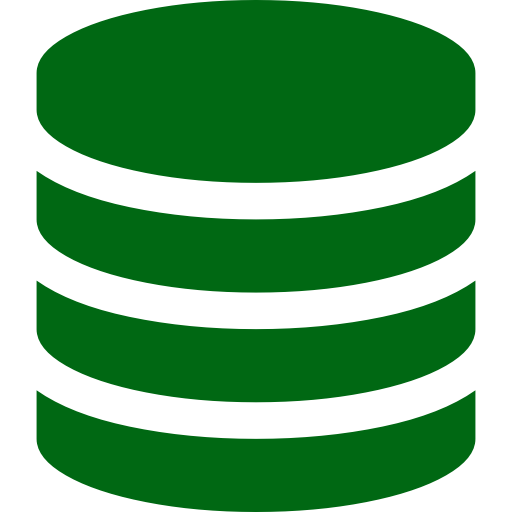

## Pollify...

## ... the vote-cast app.

**S**traight-forward, **s**imple and **f**un. :sparkles: 

Create a collection of voting options, questions or any topic being discussed in the moment and get a unique link to share with your friends, wait for them to answer and get your results displayed in a nice format for better understanding.

> ### Options for the vote-creator* user

<ul>
<li style="list-style-type: none; margin-left: -23px"><small>⭐</small> 
<b>Create</b> many collections with related options to vote.
</li>
<li style="list-style-type: none; margin-left: -23px"><small>⭐</small> <b>Realtime stats</b> of friend's answers.</li>
<li style="list-style-type: none; margin-left: -23px"><small>⭐</small> Choose when your collections <b>public/private</b>.</li>
<li style="list-style-type: none; margin-left: -23px"><small>⭐</small> Choose when to <b>close definetely</b> a collection. Users will no loger be able to answer.</li>
</ul>

\* In order to create collections you **need** to sign-up. Is fast and UI is pleasing so it'll be **ok**. :tada: :tada:

>### Options for your collaborators

<ul>
<li style="list-style-type: none; margin-left: -23px"><small>💗</small> 
<b>Get</b> winner option(s) notification on your email.
</li>
<li style="list-style-type: none; margin-left: -23px"><small>💗</small> No need for register/sign-up. Choose an username and answer anything.</li>
</ul>

***

***

### Tech stack

The fullstack is written in TypeScript.  

> *Front*

-  React 
-  TanStack Query v4 
-   Axios

> *Back*

- MongoDB free collections & Mongoose. 

- Node.js & Express.js (express-session).  